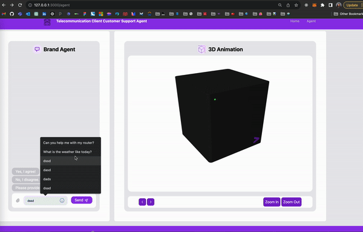
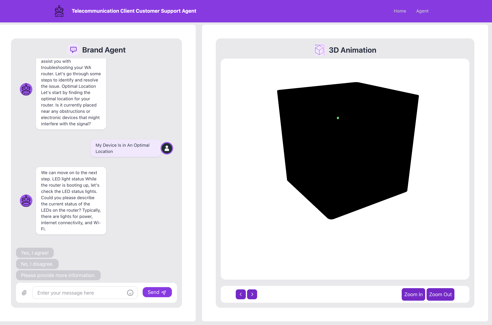
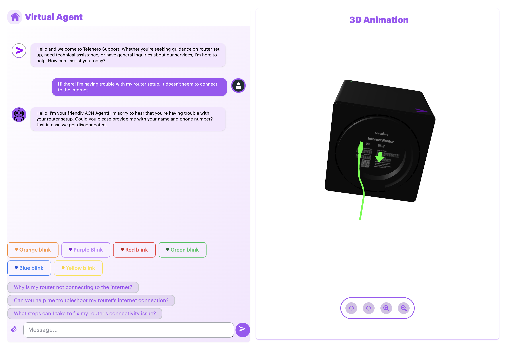
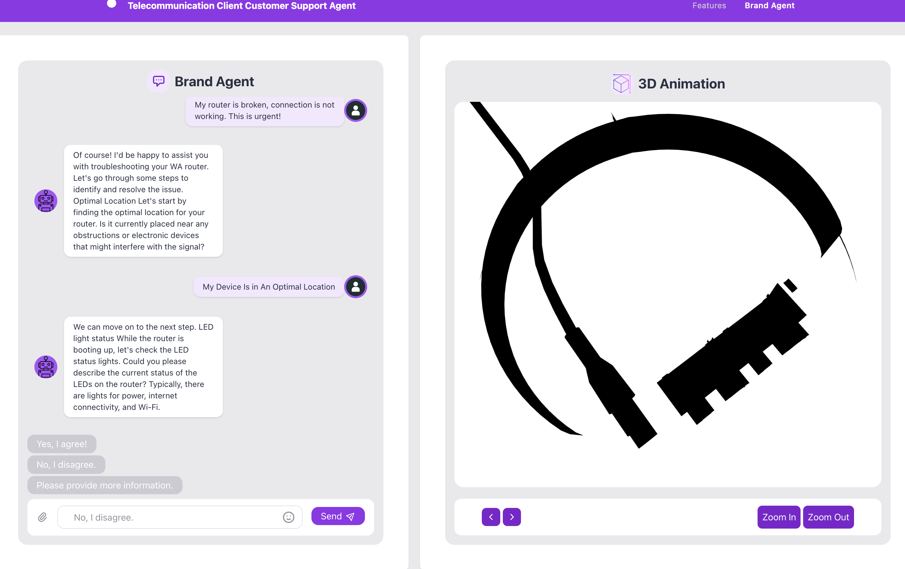
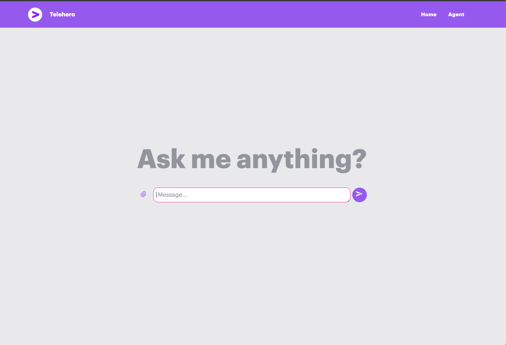
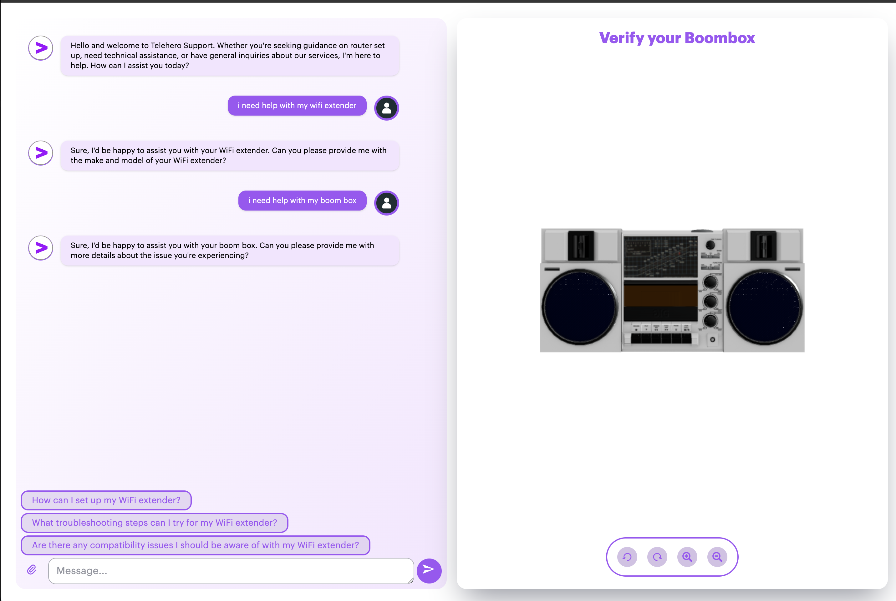
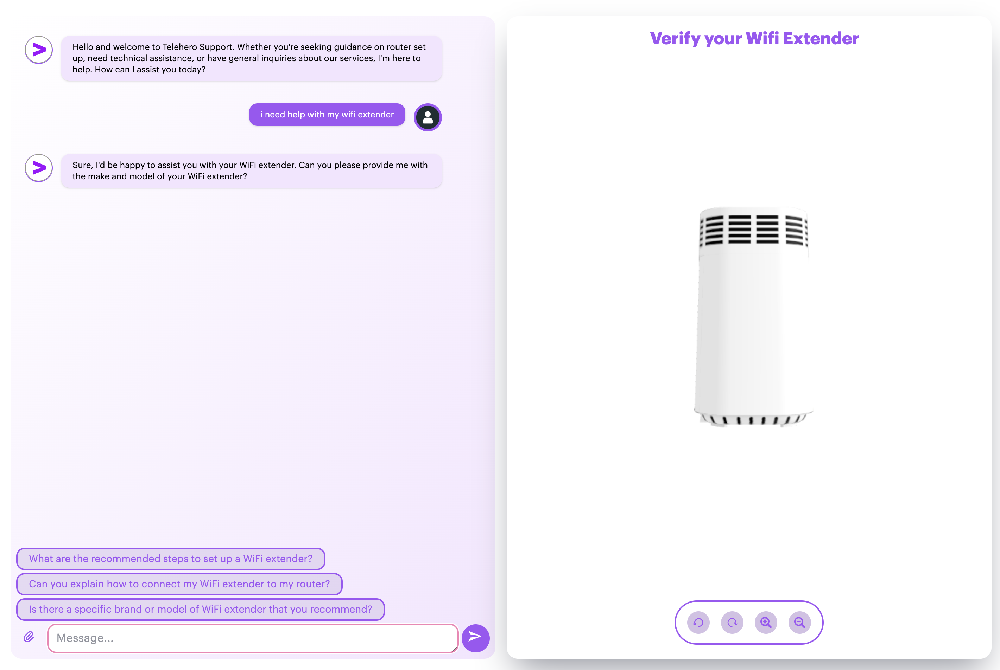
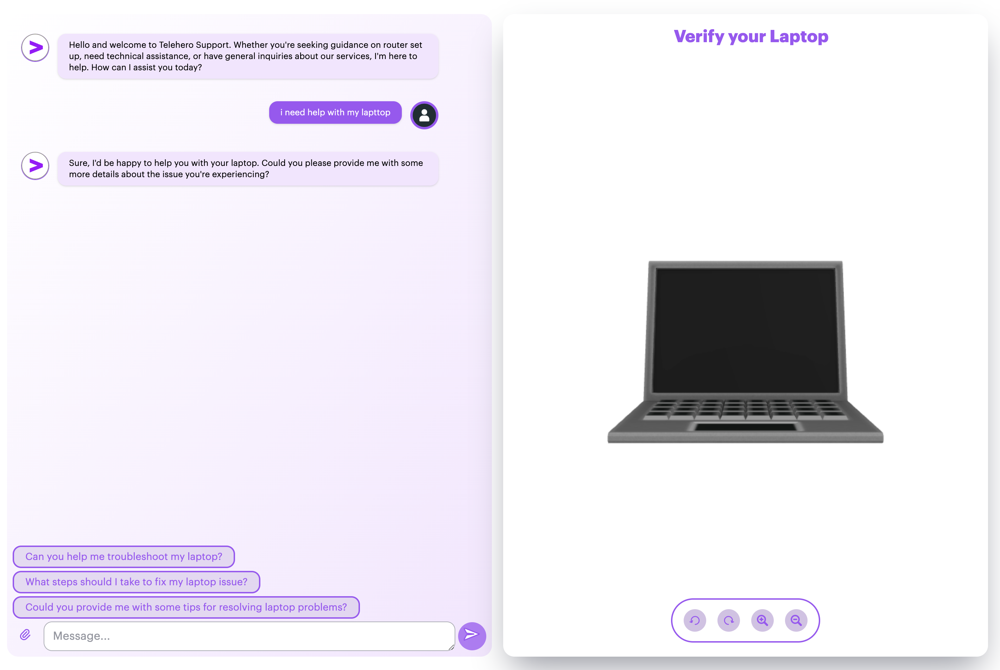

# RFC: Revolutionizing Tech Setup with 3D-AI Interactive Guides with 👾 GenAiGraphics 💬 

## Table of Contents
1. [Abstract](#abstract)
2. [Context and Business Goals](#context-and-business-goals)
3. [Stakeholders](#stakeholders)
4. [Technical Requirements](#technical-requirements)
5. [Proposed Solution](#proposed-solution)
6. [Key Features](#key-features)
7. [Implementation Plan](#implementation-plan)
8. [Measuring Success](#measuring-success)
9. [Challenges and Trade-offs](#challenges-and-trade-offs)
10. [Getting Started 🔧](#getting-started)
11. [Demo Showcase 📸](#demo-showcase)
12. [How it Works 🛠](#how-it-works)
13. [Application Flowchart 🌐](#application-flowchart)
14. [Project Structure 📁](#project-structure)

## Abstract

This RFC proposes the development and implementation of the GenAiGraphics application aimed at revolutionizing the way users interact with complex technology set ups. By integrapting 3D graphics rendering and AI-driven interactions, GenAiGraphics will provide users with an intuitive, interactive  and visual aid that simplifies the set up process, reduces user errors, and enhances overall user experience.

## Context and Business Goals

In today's fast-paced technological landscape, users are often faced with complex technology set ups that require a high level of technical knowledge and expertise to configure. This can be a daunting task for many users, leading to frustration, errors, and suboptimal user experience. GenAiGraphics aims to address this challenge by providing users with an intuitive, interactive, and visual aid that simplifies the set up process and enhances overall user experience.

The key business goals of GenAiGraphics are as follows:

1. Reducing Errors and Support Costs
2. Enhancing User Experience and Satisfaction
3. Streamlining the Set Up Process for novices and expert users 
4. Providing a Competitive Edge in the Market

## Stakeholders

- Product Team : Ensures the solution aligns with the product vision and goals
- Development Team : Responsible for the implementation and deployment of the solution
- Users : The end users who will interact with the GenAiGraphics application

## Technical Requirements

To accurately capture the 3D graphics we conducted extensive user research, gathered feedback from customer support, and reviewed existing literature on 3D graphics rendering and AI integration. 

The Key technical requirements for GenAiGraphics are as follows:
1. 3D Graphics Rendering : Utiliazation of WebGL and Three.js to render high-quality interactive 3D graphics
2. AI Chat Functionality : Integration with Azure ML Prompt Flow for intelligent, responsive chat interactions.
3. User-Friendly Interface : Development using the Astro framework and Tailwind CSS for a seamless and visually appealing user experience.
4. Scalability and Performance : Ensuring the application can handle a large number of users and complex models efficiently.
5. Robust backend : An Express server to manage API reuqests and data storage.


## Proposed Solution
1. Phase 1: Research and Planning
- Conduct user research to identify user needs and gather feedback from stakeholders
- Define the scope, requirements, and timeline for the project
2. Phase 2: Development
- Build the front-end interface using the Astro framework and Tailwind CSS
- Develop the core WebGL class using Three.js 
- Integrate the Azure ML Prompt Flow API for AI chat functionality 
- Set up the Express server for backend support
3. Phase 3: Testing and Iteration
- Conduct extensive testing to ensure the application is bug-free and user-friendly
- Gather feedback from beta users and iterate on the design
4. Phase 4: Deployment
- Deploy the application to a Azure cloud server
- Monitor performance and user feedback to make further improvements

## Key Features 
### Visual Technology Setup Assistance 🔌:
  - Helps users visually navigate technology setups, such as configuring a router. Relevant 3D models are loaded, zoomed in, and rotated based on the user's queries to demonstrate specific actions like plugging in, turning on/off, or resetting devices.
### WebGL Integration 🌐:
  - Utilizes Three.js within a core WebGL class to manage rendering, scenes, camera control, resizing events, and frame animations.
### Astro Framework 🚀:
  - Frontend is built with Astro, featuring distinct pages and reusable components. TailwindCSS is integrated for styling, and server-side settings are configured for API proxying.
### AI Chat Functionality 🤖:
  - AI-driven chatbot powered by Azure ML Prompt Flow handles user queries and provides intelligent responses and recommendations.
### Server-Side Operations 🖥️:
  - An Express server acts as middleware, managing API requests using Axios, handling CORS, and logging requests.
### Robust Tooling and Configuration 🛠️:
  - Employs TypeScript for static typing and robust tooling. Npm scripts manage build and development processes efficiently.
### Styling with TailwindCSS 🎨:
  - TailwindCSS is integrated for rapid UI development with utility-first CSS.


## Implementation Plan

1. Conduct user research and gather feedback from stakeholders
2. Define the scope, requirements, and timeline for the project
3. Develop the front-end interface using the Astro framework and Tailwind CSS
4. Build the core WebGL class using Three.js
5. Integrate the Azure ML Prompt Flow API for AI chat functionality
6. Set up the Express server for backend support
7. Conduct extensive testing and gather feedback from beta users
8. Deploy the application to an Azure cloud server
9. Monitor performance and user feedback to make further improvements

## Measuring Success

The success of the GenAiGraphics application will be measured based on the following key metrics:

1. User Engagement: The number of users interacting with the application and the average session duration.
2. Error Reduction: Reduction in the number of support tickets related to technology set up issues.
3. Engagement: User engagement metrics such as time spent on the application and interaction rates.
4. Performance: System performance metrics such as response time and scalability.

## Challenges and Trade-offs

### Challenges

- Complex of 3D Models: Ensuring the 3D models are both realistic and performant and can be challenging.
- AI Integration: Providing accurate and helpful AI responses requires robust training and fine-tuning of the models.

### Trade-offs
- Performance vs Realism: Balancing performance and realism of the 3D models with the need for a responsive and performant application.
- Development Time vs Features: Prioritizing key features to ensure a timely launch while planning for future enhancements.

## Getting Started 🔧
### 1. Installation
Clone the repository:
```
git clone https://github.com/mollybeach/genaigraphics.git
```
### 2. Navigate into the project directory:
```
cd genaigraphics
cd webapp
```
### 3. Install the dependencies:
```
npm install
```
### 4. Start the application:
```
npm run start
```

## Demo Showcase 📸



<details>
  <summary>More Application Screenshots 📸</summary>
  
  
  
  
  
  
  
  
  
  
</details>

## How it Works 🛠  

### 1. User Interaction 🖱️:
- The user types a question into the ChatBar Component and submits it.
### 2. Initial Store Update 🔄:
- The store.js triggers the updateMessagesStateEvent(), setting the $question store, adding the message to $historyMessages, and calling threejsCanvasEvent("loadingcircle") to display a loading indicator.
### 3. Azure ML Interaction ☁️:
- The store.js then calls postAzureMLMessagesData() to send the question and chat history to Azure ML.
- Azure ML processes the input and responds with relevant data.
### 4. Handling Azure ML Responses 📩:
- On success, store.js sets $botResponse, adds the AI response to $historyMessages, and calls updateAnimationsStateEvent().
- azureML.js handles further processing by sending the chat history to Azure ML for - animation and recommendation commands.
### 5. Updating Animations and Recommendations 🔧:
- Azure ML returns animation commands, which store.js uses to update animations via threejsCanvasEvent().
- It also fetches recommendation commands and updates the recommendations.
### 6. Rendering and 3D Visualization 🎨:
- The threejsCanvasEvent(command) in store.js calls mapAssetAttributesByCommand(command), setting $animationAsset and $canvasTitle, and initializes ThreeCanvas.instance.
- ThreeCanvas class initializes the 3D scene, loads assets based on attributes, and supports various asset types like glb, fbx, mp4, png, multipleGlbs, and multipleMp4s. It adds necessary lighting and controls for an interactive experience.
### 7. Chat Components 💬:
- The ChatMessages Component subscribes to $historyMessages to render messages with typing animations.
- The ChatRecommendationBar Component subscribes to $recommendations to display recommendation buttons.
- The ChatBar Component updates the textarea with selected recommendations, ensuring smooth user interaction.️

## Application Flowchart 🌐

```plaintext
Start
  |
  v
+-------------------------------+
| ChatBar Component             |
| - User types a question       |
| - User submits the question   |
+-------------------------------+
  |
  v
+-------------------------------+
| store.js                      |
| - updateMessagesStateEvent()  |
| - Sets $question store        |
| - Adds message to $historyMessages |
| - Calls threejsCanvasEvent("loadingcircle") |
+-------------------------------+
  |
  v
+-------------------------------+
| store.js                      |
| - Calls postAzureMLMessagesData(question, $historyMessages.get()) |
+-------------------------------+
  |
  v
+-------------------------------+
| azureML.js                    |
| - postAzureMLMessagesData()   |
| - Sends question and chat history to Azure ML |
| - Receives response from Azure ML |
+-------------------------------+
  |
  v
+-------------------------------+
| store.js                      |
| - On success:                |
|   - Sets $botResponse        |
|   - Adds AI response to $historyMessages |
+-------------------------------+
  |
  v
+-------------------------------+
| store.js                      |
|   - Calls updateAnimationsStateEvent() |
+-------------------------------+
  |
  v
+-------------------------------+
| azureML.js                    |
| - postAzureMLAnimationsData() |
| - Sends question and chat history to Azure ML |
| - Receives animation command from Azure ML |
+-------------------------------+
  |
  v
+-------------------------------+
| store.js                      |
|   - Calls updateRecommendationsStateEvent() |
+-------------------------------+
  |
  v
+-------------------------------+
| azureML.js                    |
| - postAzureMLRecommendationsData() |
| - Sends question and chat history to Azure ML |
| - Receives recommendations from Azure ML |
+-------------------------------+
  |
  v
+-------------------------------+
| store.js                      |
| - updateAnimationsStateEvent()|
|   - Calls threejsCanvasEvent() with new command |
| - updateRecommendationsStateEvent() |
|   - Sets $recommendations     |
+-------------------------------+
  |
  v
+-------------------------------+
| threejsCanvasEvent(command)   |
| - Calls mapAssetAttributesByCommand(command) |
| - Sets $animationAsset and $canvasTitle      |
| - Initializes ThreeCanvas.instance           |
+-------------------------------+
  |
  v
+-------------------------------+
| mapAttributes.js              |
| - mapAssetAttributesByCommand(command) |
| - Retrieves attributes from commandMap and assetMap |
+-------------------------------+
  |
  v
+-------------------------------+
| commandMap.js                 |
| - Maps commands to assets     |
+-------------------------------+
  |
  v
+-------------------------------+
| assetMap.js                   |
| - Defines asset details       |
+-------------------------------+
  |
  v
+-------------------------------+
| ThreeCanvas                   |
| - Initializes 3D scene        |
| - Loads asset based on attributes |
| - Supports various asset types (glb, fbx, mp4, png, multipleGlbs, multipleMp4s) |
| - Adds lighting and controls  |
+-------------------------------+
  |
  v
+-------------------------------+
| ChatMessages Component        |
| - Subscribes to $historyMessages |
| - Renders messages including typing animation |
+-------------------------------+
  |
  v
+-------------------------------+
| ChatRecommendationBar Component |
| - Subscribes to $recommendations |
| - Renders recommendation buttons |
+-------------------------------+
  |
  v
+-------------------------------+
| ChatBar Component             |
| - Updates textarea with recommendation on click |
+-------------------------------+
  |
  v
End

```

## Server-Side Operations
```
+-------------------------------+
| Express Server                |
| - Serves static files         |
| - Handles API requests        |
+-------------------------------+
  |
  v
+-------------------------------+
| /api/getSecret/:key           |
| - Fetches secrets from Azure  |
+-------------------------------+
  |
  v
| Azure Configuration Service   |
| - Stores configuration data   |
+-------------------------------+
```
## Python Azure Functions
```
+-------------------------------+
| Python Azure Function:        |
| telecom_ai/__init__.py        |
| - Handles AI chat processing  |
| - Sends question and chat history to Azure ML endpoint |
| - Receives and processes AI response |
+-------------------------------+
  |
  v
+-------------------------------+
| Python Azure Function:        |
| animation-helper/__init__.py  |
| - Handles animation requests  |
| - Sends question and chat history to Azure ML endpoint |
| - Receives and processes animation commands |
+-------------------------------+
  |
  v
+-------------------------------+
| Python Azure Function:        |
| recommendation-helper/__init__.py |
| - Handles recommendation requests |
| - Sends question and chat history to Azure ML endpoint |
| - Receives and processes recommendations |
+-------------------------------+

```

## Project Structure 📁
Inside of GenAiGraphics project, you'll see the following folders and files:

```
genaipgraphics/
├── .github/
│   └── workflows/
│       ├── azure-static-web-apps-gentle-ocean-0e505290f.yml
│       └── main_vz-llm.yml
├── dells-curry-python/
│   ├── animation-helper/
│   │   ├── __init__.py
│   │   ├── function.json
│   │   └── sample.dat
│   ├── recommendation-helper/
│   │   ├── __init__.py
│   │   ├── function.json
│   │   └── sample.dat
│   ├── secrets-api/
│   │   ├── __init__.py
│   │   ├── function.json
│   │   └── sample.dat
│   ├── telecom_ai/
│   │   ├── __init__.py
│   │   ├── function.json
│   │   └── sample.dat
│   ├── .gitignore
│   ├── host.json
│   └── requirements.txt
├── webapp/
│   ├── config/
│   │   ├── astro.config.mjs
│   │   ├── config.js
│   │   ├── pretter.config.cjs
│   │   ├── tailwind.config.cjs
│   │   └── tsconfig.json
│   ├── public/
│   │   ├── images/
│   │   │   ├── png/
│   │   │   │   ├── bot.png
│   │   │   │   └── user.png
│   │   │   ├── readme/
│   │   │   │   ├── brand-agent.png
│   │   │   │   ├── cable-router.png
│   │   │   │   ├── home-page.png
│   │   │   │   └── router-green-button.png
│   │   │   └── svg/
│   │   │       └── favicon.svg
│   │   └── models/
│   │       ├── fbx/
│   │       │   ├── model_RouterDiff.png
│   │       │   ├── model_RouterNrm.png
│   │       │   └── model_RouterOriginal.fbx
│   │       ├── glb/
│   │       │   ├── model_BoomBox.glb
│   │       │   ├── model_CreditCard.glb
│   │       │   ├── model_DesktopPC.glb
│   │       │   ├── model_EmojiHeart.glb
│   │       │   ├── model_FilmClapperBoard.glb
│   │       │   ├── model_FolderIcon.glb
│   │       │   ├── model_Laptop.glb
│   │       │   ├── model_LowPolyPhone.glb
│   │       │   ├── model_MovieReel.glb
│   │       │   ├── model_MusicIcons.glb
│   │       │   ├── model_PhoneCallIcon.glb
│   │       │   ├── model_PhoneRingIcon.glb
│   │       │   ├── model_Plane.glb
│   │       │   ├── model_RemoteControl.glb
│   │       │   ├── model_RollingBag.glb
│   │       │   ├── model_SaveToCloud.glb
│   │       │   ├── model_SecurityCamera.glb
│   │       │   ├── model_Sports.glb
│   │       │   ├── model_Television.glb
│   │       │   ├── model_VideoGameController.glb
│   │       │   ├── model_VideoGameController2.glb 
│   │       │   ├── model_WifiExtender.glb
│   │       │   ├── model_WifiIcon.glb
│   │       │   ├── model_LogoAccenture.glb
│   │       │   ├── model_Router90DegreeRotation.glb
│   │       │   ├── model_RouterCableTexture.glb
│   │       │   ├── model_RouterLightBlinkTexture.glb
│   │       │   ├── model_RouterNoTexture.glb
│   │       │   └── model_RouterResetButtonTexture.glb
│   │       ├── gltf/
│   │       │   ├── model_RouterCableTexture.gltf
│   │       │   ├── model_RouterLightBlinkTexture.gltf
│   │       │   ├── model_RouterNoTexture.gltf
│   │       │   └── model_RouterResetButtonTexture.gltf
│   │       ├── glsl/
│   │       │   ├── earth.glsl
│   │       │   └── sphere.glsl
│   │       ├── mp4/
│   │       │   ├── model_PhoneBlack.mp4
│   │       │   ├── model_PhoneBlue.mp4
│   │       │   ├── model_PhoneColorsAll.mp4
│   │       │   ├── model_PhoneColorsMauve.mp4
│   │       │   ├── model_PhoneColorsRed.mp4
│   │       │   ├── model_PhoneColorsWhite.mp4
│   │       │   ├── model_PhoneColorsYellow.mp4
│   │       │   ├── model_House.mp4
│   │       │   ├── model_House1stHalf.mp4
│   │       │   ├── model_House2ndHalf.mp4
│   │       │   ├── model_House2nd.mp4
│   │       │   ├── model_HouseZoom.mp4
│   │       │   ├── model_Upsell1st.mp4
│   │       │   ├── model_Upsell2nd.mp4
│   │       │   ├── model_Upsell3rd.mp4
│   │       │   ├── model_Upsell4th.mp4
│   │       │   ├── model_Upsell5th.mp4
│   │       │   ├── model_UpsellPhoneColorsMultiStep1st.mp4
│   │       │   └── model_UpsellPhoneColorMultistep2nd.mp4
│   │       └── spjs/
│   │           ├── torus.spjs
│   │           └── sphere.spjs
│   ├── src/
│   │   ├── api/
│   │   │   └── azureML.js
│   │   ├── components/
│   │   │   ├── animations/
│   │   │   │   ├── Canvas.astro
│   │   │   │   ├── CanvasBar.astro
│   │   │   │   └── CanvasScene.astro 
│   │   │   ├── common/
│   │   │   │   ├── Box.astro
│   │   │   │   ├── Card.astro
│   │   │   │   ├── CardHeader.astro
│   │   │   │   ├── CardHolder.astro
│   │   │   │   └── Container.astro
│   │   │   ├── messages/
│   │   │   │   ├── Chat.astro
│   │   │   │   ├── ChatBar.astro
│   │   │   │   ├── ChatMessages.astro
│   │   │   │   └── ChatRecommendationBar.astro
│   │   │   ├── primitives/
│   │   │   │   ├── Button.astro
│   │   │   │   ├── Link.astro
│   │   │   │   └── Svg.astro
│   │   │   └── templates/
│   │   │       ├── Footer.astro
│   │   │       ├── Header.astro
│   │   │       └── Hero.astro 
│   │   ├── data/
│   │   │   ├── assets
│   │   │   │   ├── fbxAssets.js
│   │   │   │   ├── glbAssets.js
│   │   │   │   ├── glslAssets.js
│   │   │   │   ├── mp4Assets.js
│   │   │   │   ├── multipleGlbsAssets.js
│   │   │   │   ├── multipleMp4sAssets.js
│   │   │   │   └── spjsAssets.js
│   │   │   ├── text
│   │   │   │   ├── sampleMessageData.js
│   │   │   │   └── sampleRecommendationsData.js
│   │   │   ├── assetMap.js
│   │   │   ├── baseCommand.js
│   │   │   └── commandMap.js
│   │   ├── graphics/ 
│   │   │   ├── core/
│   │   │   │   └── WebGL.js
│   │   │   ├── shader/
│   │   │   │   ├── fragmentShader.glsl
│   │   │   │   └── vertexShader.glsl
│   │   │   ├──utils/
│   │   │   │       └── OrbitControls.ts
│   │   │   └── ThreeCanvas.ts
│   │   ├── layouts/
│   │   │   └── Layout.astro
│   │   ├── pages/
│   │   │   ├── agent.astro
│   │   │   └── index.astro
│   │   ├── stores/
│   │   │   └── store.js    
│   │   └── styles/
│   │       ├── classStyles.js 
│   │       └── svgStyles.js
│   ├── types/
│   │   └── env.d.ts
│   │       ├── env.d.ts
│   │       └── glsl.d.ts
│   ├── .env
│   ├── package.json
│   ├── server.cjs
│   └── README.md
├── .gitignore  
└── README.md
```
Astro looks for `.astro` or `.md` files in the `src/pages/` directory. Each page is exposed as a route based on its file name.

There's nothing special about `src/components/`, but that's where we like to put any Astro/React/Vue/Svelte/Preact components.

Any static assets, like images, can be placed in the `public/` directory.

## 🧞 Commands

All commands are run from the root of the project, from a terminal:

| Command                   | Action                                           |
| :------------------------ | :----------------------------------------------- |
| `npm install`             | Installs dependencies                            |
| `npm run dev`             | Starts local dev server at `localhost:3000`      |
| `npm run build`           | Build your production site to `./dist/`          |
| `npm run preview`         | Preview your build locally, before deploying     |
| `npm run astro ...`       | Run CLI commands like `astro add`, `astro check` |
| `npm run astro -- --help` | Get help using the Astro CLI                     |

## 👀 Want to learn more?

Feel free to check [our documentation](https://docs.astro.build) or jump into our [Discord server](https://astro.build/chat).
.

